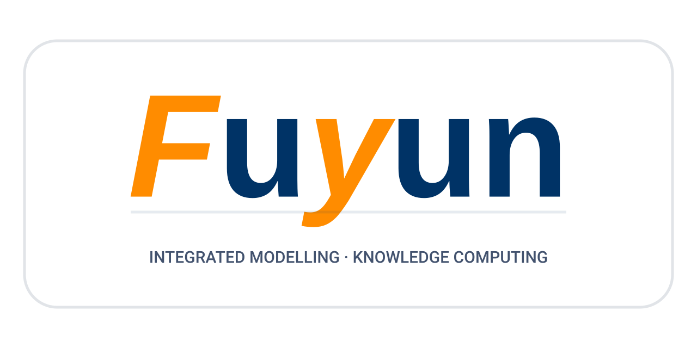

fusion-yun.github.io
====================

<p align="center"></p>

**FuYun 的发布站点** —— <https://fusion-yun.github.io/>

> 「"神马"都是"浮云"」

本仓即站点本身：GitHub Pages 组织站点，Jekyll 构建，推送 `main` 由
[`.github/workflows/jekyll-gh-pages.yml`](.github/workflows/jekyll-gh-pages.yml) 部署。
站点承担两件事：

1. **FuYun 的入口与导览** —— 首页 [`index.md`](index.md)：构成、状态与对外公开面。
2. **fylite 在线演示的托管** —— `/fylite/`，WebAssembly 内核在浏览器内计算。

> **`/spo/` 与 `/fyo/` 已于 2026-08-23 撤下**（上游材料权利未清，待复核）。两棵树连同
> 站点许可通告的 Part B 一并移除；前缀 IRI `https://fusion-yun.github.io/spo/…` 与
> `…/fyo/…` 目前不解析。`SP-ADR-103` D-1 / D-2（本站为本体命名空间权威主机）因此暂时
> 失效，复核结论出来前不要恢复发布。spo / fyo 仓的 `core.hooksPath` 自动发布钩子已停用。

## 目录

| 路径 | 内容 | 真源 |
| :--- | :--- | :--- |
| `index.md` | 首页（Jekyll 渲染）| 本仓 |
| `_config.yml` | 站点标识：标题、描述、语言、主题（`jekyll-theme-primer`）| 本仓 |
| `_includes/head-custom.html` | 主题头部注入：favicon 指向 `figures/fuyun_mark.svg` | 本仓 |
| `figures/` | 站点图形：`fuyun_logo.svg` 横幅标识、`fuyun_mark.svg` 方形标记（favicon / 头像）、`fuyun_architecture_legacy.png` 早期架构图（存档，页面已不再引用）| 本仓 |
| `LICENSE` | 站点分路径许可通告（Part A/C；Part B 已撤）| 本仓 |
| `fylite/` | fylite 在线演示（`index.html` 说明与出处、`discharge.html` 放电设计、`reconstruction.html` 动理学平衡重构、`assets/`）| 私有仓 `fusion-yun/fylite` 的 `app/` |

## 同步来的目录不要手工编辑

`fylite/` 是**发布产物**，在本仓的修改会在下次发布时被覆盖。改内容请改真源仓，再重新发布：

- **`fylite/`** —— 由私有仓 `fusion-yun/fylite` 的 `.github/workflows/publish-app.yml`
  同步（手动触发，写权限 deploy key）。演示页只分发**二进制**：
  `assets/fylite_rs.wasm` 是 Rust 内核的 WebAssembly 构建，**不含源码**；
  `assets/*.js` 只做数据编排、绘图与 ABI 调用，求解全部在二进制内。

## 本地预览

```bash
gem install bundler jekyll     # 或使用 github-pages gem 以对齐线上版本
jekyll serve                   # http://127.0.0.1:4000/
```

`fylite/` 无 front matter，Jekyll 原样拷贝，不经 Liquid 处理。

## 标识

`figures/fuyun_logo.svg` 与 `figures/fuyun_mark.svg` 只用矢量图元与系统字体，**不依赖外部资源**，
可任意缩放；页面引用保持 SVG 形态，不转位图。构成与 FyTok 仓的 `docs/figures/fytok_logo.svg`
同族，便于并置：

- **配色**：`#FF8C00` 等离子体橙 + `#003366` 深蓝；副题 `#42526E`，卡片描边 `#e1e4e8`。
- **词标**：`Fuyun` —— 橙色斜体落在 `F` 与 `y` 两个字符上，二者连读即 `Fy`；其余字符深蓝正体。
- **标记**：即词标中被高亮的两个字符 `Fy`，同一张卡片、同一套配色，用作 favicon 与头像。
- **底色**：两份**全透明**，只画圆角描边的卡片轮廓与文字，可直接压在任意底色上；
  因此**禁止**再给卡片 `rect` 加 `fill`（深色底下另配浅色变体，不要往这两份里塞底色）。
- **横幅**：1280×640（2:1）透明画布，内嵌 240×100 卡片（圆角、描边），词标居上、
  分隔线下为字距展开的英文副题；副题以 `textLength` 钉定宽度，使不同字体环境下的
  溢出行为一致。

改动标识时两个文件一起改。另注：FyTok 仓那份 `fytok_logo.svg` 里 `fill="url(#bg)"` 引用了
文件中并不存在的渐变，渲染器按"无填充"处理——那份的底色实际上也从未画出来过。

## 许可

站点材料分两部分，按服务路径判定，完整文本见 [`LICENSE`](LICENSE)（`/fylite/` 树内另有一份
随制品携带的同款通告）：站点自身为 **CC BY-ND 4.0**；`/fylite/` 下的二进制制品适用
**二进制再分发许可**（可免费逐字节再分发，源码不公开）。

Copyright © 2024–2026 YU Zhi（于治），ASIPP。
