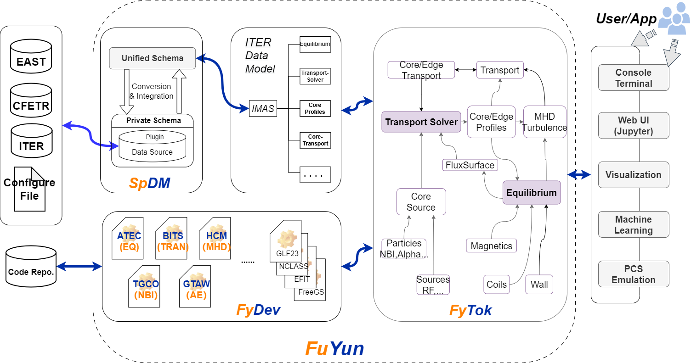

## 目标

- 面向科学工程的知识管理和计算环境
- 构建可计算的知识图谱
- 构建基于本体的模拟和建模
- 构建科学装置的数字孪生

## 在线演示

[**fylite 在线演示**](./fylite/) —— fylite 的 Rust 平衡内核编译为 WebAssembly，
在浏览器里直接跑，无服务端计算：

- [放电设计](./fylite/discharge.html)：给定目标位形反解 PF 线圈电流，再做自由边界
  Grad–Shafranov 求解校验。
- [动理学平衡重构](./fylite/reconstruction.html)：由极向磁通环测量加压强约束拟合
  p′/FF′ 剖面；可直接跑 EAST 真实炮数据。

## 子系统:

- **SpDM**:  a data integration tool designed to organize scientific data. http://fusion-yun.github.io/spdm/
   - Install: `pip install spdm`

- **FyTok**: Tokamak integrated modeling and analysis toolkit. http://fusion-yun.github.io/fytok/
   - Install: `pip install fytok`

- **fylite**: 自足的托卡马克平衡求解与重构包（Rust 内核 + Python 前端）。
   - 在线演示: [fusion-yun.github.io/fylite/](./fylite/)

## 本体 (Ontologies)

语言中立的 LinkML T-Box，编译为 OWL / SHACL / JSON-LD 发布；任何 RDF 工具可直接消费，
无需 Python 或 LinkML。两个命名空间当前均为 **`v0.draft`——非稳定命名空间**，术语可在
无弃用期的情况下变更；首个正式发布将另铸 `v1`。

- **SpO** — Sp 生态上层本体（BFO-3D 核 + 4D 时空扩展、量—域—场—信号、时间 AoS/SoA 对偶、
  几何、受控词表、溯源）。
  - 命名空间: `spo: https://fusion-yun.github.io/spo/v0.draft/` ·
    [浏览](./spo/v0.draft/) ·
    [`context.jsonld`](./spo/v0.draft/context.jsonld) ·
    [OWL](./spo/v0.draft/spo.owl.ttl) · [SHACL](./spo/v0.draft/spo.shacl.ttl)

- **FyO** — 聚变域本体（装置层 + IMAS DD v4 的语义提升层，接地于 SpO/BFO）。
  - 命名空间: `fyo: https://fusion-yun.github.io/fyo/v0.draft/` ·
    [浏览](./fyo/v0.draft/) ·
    [`context.jsonld`](./fyo/v0.draft/context.jsonld) ·
    [OWL](./fyo/v0.draft/fyo.owl.ttl) · [SHACL](./fyo/v0.draft/fyo.shacl.ttl)

二者均以 [CC BY-ND 4.0](./LICENSE) 发布。以 `imports:` / `@context` / `owl:imports` /
`@type` 引用本体**不构成**演绎，不受 NoDerivatives 条款限制。