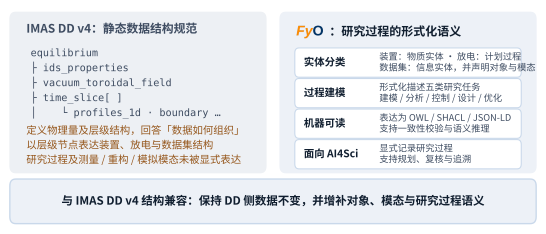
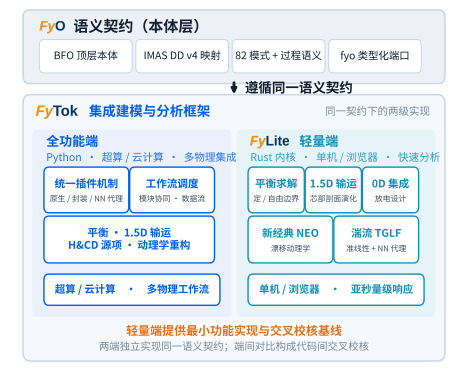
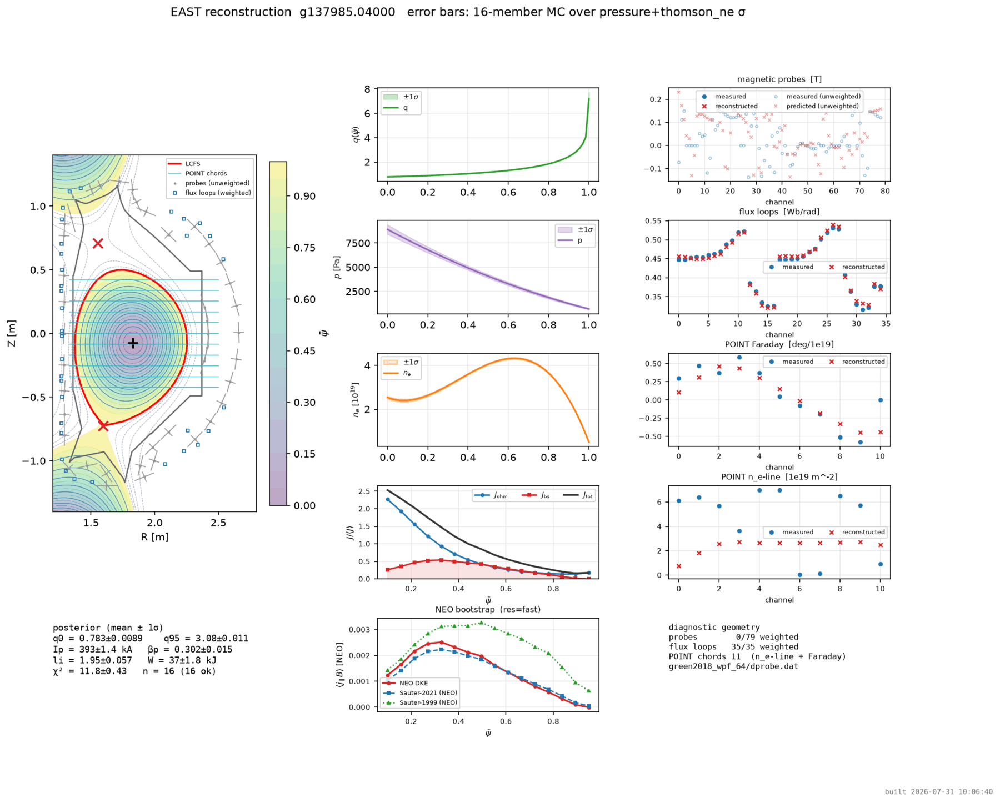
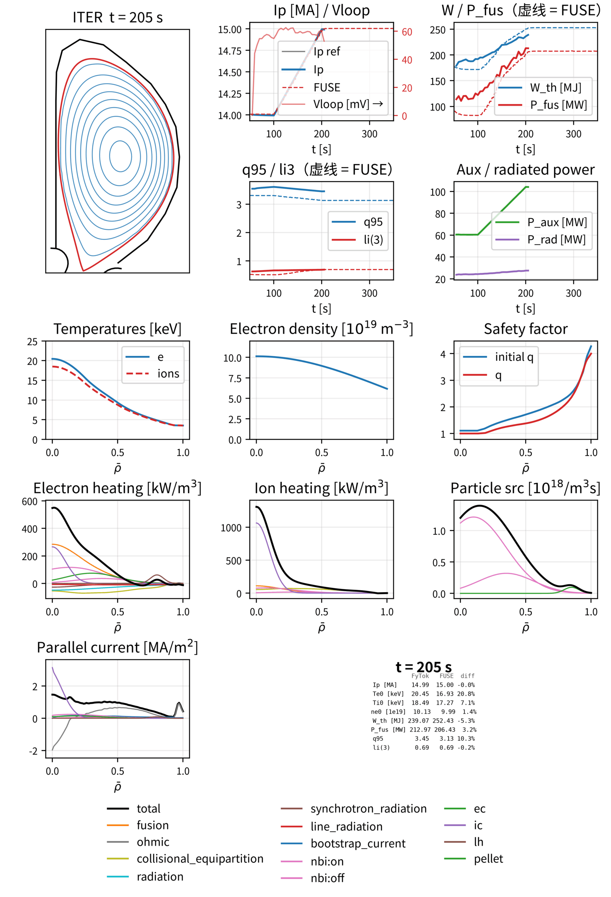
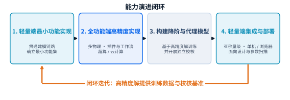
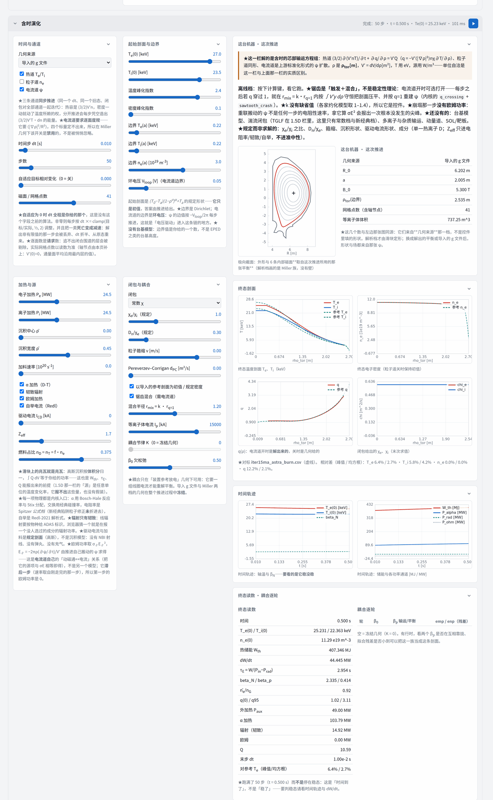

> 「"神马"都是"浮云"」

**FuYun** 是一套面向聚变研究与工程的集成建模软件。托卡马克集成建模需要在异构数据结构、
物理模型和计算环境之间保持一致的物理语义：**FyTok** 是其中的集成建模与分析框架，以本体层
**fyo** 作为统一语义契约——物理量按语义路径寻址，物理模型通过插件接口接入，原生实现、
外部程序封装与神经网络代理可在同一接口下互换。

求解范围覆盖定边界、自由边界及演化平衡，1.5D 芯部输运（新经典与准线性湍流）、H&CD 源项
和动理学平衡重构，形成从实验数据读取到剖面演化预测的建模链路。

本站发布 FuYun 对外可直接引用的公开部分：[浏览器内运行的在线演示](./fylite/)，及其许可与
出处说明。下文的图件与数字取自 NFEC2026 张贴报告《FyTok：托卡马克集成建模与分析框架》。

---

## 语义契约：fyo

**在结构层面**，fyo 与 IMAS 数据字典（DD v4）的 82 个数据集模式逐项映射，既有 DD 数据无需
改写即可读写。**在语义层面**，fyo 以 BFO（ISO/IEC 21838-2）为顶层框架，把装置、放电、诊断、
数据集及研究任务建模为相互关联的本体对象，并显式记录数据所描述的对象、模态及生成过程，
从而支持机器可读、可推理和可追溯的 AI4Sci 工作流。

<figure>
  
  <figcaption><strong>图 1</strong>　fyo 对 IMAS DD 的结构描述增加研究过程语义：除数据形态外，
  进一步表达对象、模态、任务及其上下文，为 AI4Sci 工作流提供可追溯的语义基础。</figcaption>
</figure>

## 两级实现

同一份语义契约有两级实现。**全功能端 FyTok**（Python）面向多物理集成及超算、云计算环境；
**轻量端 fylite** 以 Rust 重构关键求解器，面向亚秒量级响应的快速设计、参数扫描与浏览器端
分析，并作为全功能端的最小功能验证。两端遵循同一契约、彼此独立实现，因而端间对比构成
代码间交叉校核，而非自证。

- **一套数据约定，跨装置通用。** 装置几何、线圈与诊断布置、放电数据按 IMAS 数据字典组织；
  在 EAST 上写好的分析流程，换到另一台装置不必重写。
- **物理模块可替换。** 平衡、输运、源项等各自成块，以插件方式注册；只换掉其中一个再跑一遍
  作对照，不必改动整条链路。
- **算完能说清怎么来的。** 输入数据、代码版本与判定依据随结果一起留档，便于复算、横向对比，
  以及成文时交代清楚。

<figure>
  
  <figcaption><strong>图 2</strong>　fyo 语义契约连接 FyTok 全功能端（Python）与 fylite 轻量端
  （Rust 内核、浏览器端），使两级实现能够共享数据语义并开展交叉校核。</figcaption>
</figure>

## 代表性结果

物理模块依据公开文献和开源实现进行白盒移植，并依次开展**模块级参考基准**、**代码间交叉
比对**与**装置级算例**校核。以下两例分别是装置级重构与代码间一致性检验。

### EAST 动理学平衡重构

EAST 算例检验约束驱动的平衡—动理学自洽重构及不确定度量化。移植验证线将既有 Fortran 求解器
经最小改动封装为共享动态库，并由 Python 统一调度；**该线代码不对外分发，对外的是它的结果与
记录答案**——公开发布的 fylite Rust 轻量端即以这些记录答案为基准，开展逐位复现与跨代码交叉
比对。

<figure>
  
  <figcaption><strong>图 3</strong>　<strong>动理学重构在给定约束集下自洽收敛，并给出可量化的
  不确定度。</strong> EAST #137985（<em>t</em> = 4.0 s）EFIT↔NEO 重构，磁通环 35/35 + POINT +
  Thomson 约束（磁探针未加权）；16 成员蒙特卡洛系综 16/16 收敛、两次独立取数逐位复现，后验
  q0 = 0.783±0.009、q95 = 3.08±0.011、li = 1.95±0.057、
  βp = 0.302±0.015、W = 37.0±1.8 kJ——<strong>是给定约束集下的后验，非装置真值</strong>（实算）。</figcaption>
</figure>

### ITER 15 MA 时序演化

<figure>
  
  <figcaption><strong>图 4</strong>　<strong>W、Pfus 与 q95 / li3
  从爬升到平顶全程与 FUSE 同情景对拍一致。</strong> fytok ITER 15 MA 时序模拟（<em>t</em> = 205 s，
  12 面板全景 + 全局量对照）：逐步真 Grad–Shafranov 磁面、剖面族、逐源分解与时间迹；电流扩散、
  输运、台基与源项自洽推进，TGLF-NN + EPED-NN 台基闭合——<strong>属代码间一致性检验，非实验
  验证</strong>（实算）。</figcaption>
</figure>

## 能力演进路线

<figure>
  
  <figcaption><strong>图 5</strong>　能力演进闭环：轻量端先贯通建模链路、确立最小功能集，
  全功能端给出高精度解，高精度解再训练降阶与代理模型并回灌轻量端；每一轮的高精度解同时是
  下一轮的训练数据与校核基准。</figcaption>
</figure>

---

## 在线分析

**fylite 浏览器端交互建模**：关键求解器以 Rust 重写并编译到浏览器内执行。用户无需安装软件、
无需连接计算服务即可完成参数设置、求解和可视化，**输入与结果保留在本机**。各场景按计算依赖
组织为连续功能栏，用于复现实验分析与情景建模流程。单次求解约一到两秒。

[**FyLite 在线演示**](./fylite/) —— 当前已发布两页，均打开即用：

- [**放电设计**](./fylite/discharge.html) —— 给定目标截面形状与等离子体参数，反解所需的
  极向场线圈电流，再正算一遍自由边界 Grad–Shafranov 平衡，校验真正得到的位形。
- [**动理学平衡重构**](./fylite/reconstruction.html) —— 由极向磁通环/磁探针测量加压强约束
  反演 p′/FF′ 剖面；可跑 EAST 真实放电数据，也可跑真值已知的合成算例。

页面支持 GEQDSK（g 文件）与 JSON 会话文件的导入导出。

<figure class="shot">
  
  <figcaption><strong>图 6</strong>　轻量端建模页「含时演化」栏的实截，算例是 <strong>ITER
  15 MA 感应燃烧点的复现对标</strong>：参考平衡（<code>g900003.00230</code>）与 ASTRA 剖面表
  一并导入，在那张 ψ 上追出逐面度规，以参考剖面为初值与规定密度、参考加热 49 MW、
  χ0 = 0.6 m²/s 推 50 步 × 10 ms = 0.5 s：Pα = 103.8 MW（参考 102.8）、
  <strong>Q = 10.6</strong>（ITER 设计值 10）、Wth = 407 MJ（参考 383）、
  Te 剖面相对差 6.4 % / 2.7 %（峰值 / 均方根）。 
  <em>该页面尚未上线，随下一次演示同步发布；站内现有的是上列两页。</em></figcaption>
</figure>

---

## 许可

本站两类材料分别适用不同条款，以文件服务路径判定（完整文本见 [LICENSE](./LICENSE)）：

| 路径 | 材料 | 条款 |
| :--- | :--- | :--- |
| 站点其余部分 | 页面、散文、图形、样式 | [CC BY-ND 4.0](./LICENSE) |
| `/fylite/` | FyLite 二进制制品与装载脚本 | [二进制再分发许可](./fylite/LICENSE) |

**FyTok · FyLite · FyO** 采用 Apache-2.0 授权，源码仓库暂未公开。

**参照实现**　General Atomics（GACODE，Apache-2.0）　·　ProjectTorreyPines（Apache-2.0）
　·　CEA / IRFM（METIS，CeCILL-C）

**对比数据**　EAST 团队（ASIPP）　·　ITER 组织（IMAS 数据字典与情景）

---

## In brief (English)

**FuYun** is integrated-modelling software for fusion research and engineering. **FyTok**, its
integrated modelling and analysis framework, uses the ontology layer **fyo** as a single semantic
contract: quantities are addressed by semantic path, and physics models plug in behind one
interface, so a native implementation, a wrapped external code and a neural-network surrogate are
interchangeable. Structurally, fyo maps one-to-one onto the 82 dataset schemas of the IMAS Data
Dictionary (DD v4), so existing DD data is read and written unchanged; semantically, it models
machines, discharges, diagnostics, datasets and research tasks as related ontological objects,
recording what each dataset is about, by which modality and through which process — the basis for
machine-readable, inferable and traceable AI4Sci workflows.

Solvers cover fixed-boundary, free-boundary and evolving equilibrium, 1.5-D core transport
(neoclassical and quasi-linear turbulence), heating and current-drive sources, and kinetic
equilibrium reconstruction. Two implementations share the one contract: the full-capability end
(Python, for HPC and cloud) and the lightweight end **fylite** (Rust kernels, sub-second, in the
browser), which doubles as the minimal functional verification of the former; because the two are
independent implementations of the same contract, comparing them is a code-to-code cross-check.
Verification proceeds in stages — module-level reference benchmarks, code-to-code comparison, and
device-level cases such as the EAST kinetic reconstruction and the ITER 15 MA time-dependent run
shown above.

One part is published here. [**FyLite**](./fylite/) runs tokamak discharge design and kinetic
equilibrium reconstruction entirely in the browser, with nothing to install and no data leaving
the machine. Source repositories are not public; see [LICENSE](./LICENSE) for the per-path terms.

---

<small>Copyright © 2024–2026 中国科学院合肥物质科学研究院等离子体物理研究所（ASIPP） 
Institute of Plasma Physics, Chinese Academy of Sciences</small>

